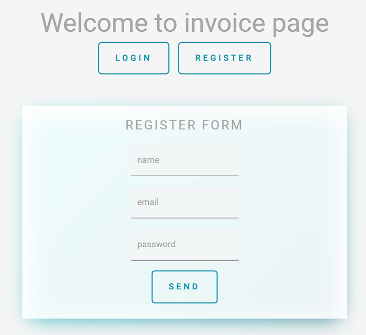

# 💰 Control de Operaciones — React · Node · Express · MySQL

Challenge fullstack realizado para **Alkemy Campus**.

> Registro de usuarios · Ingresos y gastos · Filtro por categorías · Últimos movimientos · Balance total

---

## ✨ Características

- Registro e inicio de sesión de usuarios.
- Alta de operaciones financieras (ingresos y gastos).
- Listado completo de movimientos del usuario.
- Últimos 10 movimientos recientes.
- Filtro por categorías.
- Edición y eliminación de operaciones.
- Cálculo automático del balance total.
- Cada usuario ve únicamente sus propias operaciones.

---

## 🖼️ Screenshots

| Vista | Imagen |
|------|------|
| Login / Registro |  |
| Últimos movimientos |  |
| Nueva operación |  |
| Operaciones por categoría |  |

---

## 📦 Tech Stack

### Frontend
- React
- Material UI
- Axios

### Backend
- Node.js
- Express

### Base de Datos
- MySQL

---

## 🔐 Autenticación

La aplicación utiliza un **token basado en el `id_user`** generado al iniciar sesión.

Este token se envía en los headers de las peticiones al backend para:

- identificar al usuario
- asociar operaciones a su cuenta
- restringir el acceso a sus propios movimientos

---

## 🔌 Endpoints API (resumen)

### Auth
POST /api/users/login
POST /api/users/register

### Operations
GET /api/operations
GET /api/operations/last_operations
GET /api/operations/:id

POST /api/operations
DELETE /api/operations/:id
PUT /api/operations/:id

---

## ⚙️ Configuración

### Backend
Archivo `.env`

DB_HOST=localhost
DB_USER=root
DB_PASSWORD=
DB_NAME=ibm_alkemy2022
PORT=3600

---

## 🗄️ Base de datos

Tablas principales:

### users
id_user
name
email
password

### operations
id_operation
concept
amount
date
type
category
id_userLogin

Relación:
operations.id_userLogin → users.id_user

---

## 🚀 Arranque rápido

### Requisitos
- Node.js
- MySQL
- npm

---

### Backend
cd Server
npm install
npm start

---

### Frontend
cd Client
npm install
npm start

La aplicación se ejecutará en:
http://localhost:3000

---

## 🗺️ Mejoras futuras

- Autenticación con **JWT**
- Password hashing con **bcrypt**
- Validaciones más robustas en backend
- Dashboard de estadísticas
- Gráficos de gastos
- Deploy en **Vercel + Railway**

---

## 🧠 Notas
Este proyecto forma parte del challenge fullstack de **Alkemy Campus**, enfocado en el desarrollo de una aplicación CRUD completa utilizando React y Node.js.
